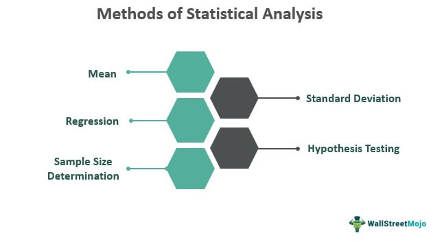

```{r, echo = FALSE}
library(formatR)
```

\pagenumbering{gobble}

\begin{centering}

\Large

{\bf An Statistical Manual Book For Data Analysis in R}

\vspace{1cm}


\end{centering}



\begin{centering}

\vspace{1cm}

{\bf Submitted by}

Manasvi Lamichhane

BSC Medical Science

\vspace{3cm}

White House College

PutaliSadak, Kathmandu


\vspace{4cm}

2024

\end{centering}

\newpage

\pagenumbering{roman}

\tableofcontents

\newpage

\listoftables

\newpage

\listoffigures

\newpage

# Acronyms

\newpage

\pagenumbering{arabic}

# Background

## Introdcution

The medical science is very crucial for modern health problems @collins_implications_2001. The basic science is started from early 1800 [@parajuli2022].

## Objectives

### General Objectives

The overall objectives of the study is to determine whether the temperature has its significant effect on plant growth.

### Specific Objectives

To fulfill the general objective of the study following specific objectives are designed.

1.  specific objective 1

2.  specific objective 2

-   specific objective 1
    -   specific objective 1.1
    -   specific objective 1.2
-   specific objective 2

## Limitations

**BOLD** is favorite format.

*Italic* is less favorite

***BOLDitalic*** is less used.

\underline{Underlined statement}

\newpage

# Literature Review

\newpage

# Methodology

## Study Area

## Data Collection

### Primary Data

### Secondary data

**Table from latex script**

| s.n. | Primary Data           | Secondary Data             |
|------|------------------------|----------------------------|
| 1    | Questionnaire Survey   | Articles                   |
| 2    | Focus Group Discussion | Published National Reports |

: The Data source

## Data Anlayis

```{r summary, echo = FALSE, warning=FALSE,message=FALSE,tidy=TRUE}
pacman::p_load(dplyr,ggplot2)
iris %>%
  group_by(Species) %>%
  summarise(n = n(),
            sepal_length = mean(Sepal.Length),
            Petal_Length = mean(Petal.Length)) -> iris_summary
knitr::kable(iris_summary,digits = 3,caption = "The Summary Iris data", col.names = c("Species","Number of Samples","Mean Sepal Length(cm)","Mean Petal Length (cm)"))
```

In the figure, the mean sepal length of setosa species is `r mean(iris[which(iris$Species == "setosa"),1])`.

### Descriptive


**Another Method**

```{r, fig.height=4, fig.width=4,out.width="60%",fig.align='center',fig.cap="Satsitical Analysis in R"}

```

### Statistical Anlaysis

```{r, comment = NA,message = FALSE,warning = FALSE, fig.height=5, fig.align='center',fig.width=5,fig.cap="The distribution of Sepal Length in Species"}
head(iris)
iris %>%
  ggplot(aes(x = Sepal.Length)) +
  geom_histogram(bins = 30, color = "black", fill = "blue") +
  facet_wrap(~Species) +
  labs(x = "Sepal Length", y = "Frequency") +
  theme_bw()

```

\newpage

# Result

\newpage

# Discussion

$$ \overline{X} = \frac{\sum{X_i}}{N}$$ \newpage

The formula for volume is $V = L \times B$.

$$V = L \space \times \space B \tag{i}$$

$$x = \frac{-b  +  \sqrt{b^2 -4ac}}{2ab} \tag{ii}$$

$$ r_{xy} = \frac{\sum(x_i - \bar{x}) (y_i - \bar{y})}{\sqrt{\sum(x_i - \bar{x})^2 \sum(y_i- \bar{y})^2}} $$

# Conclusions


\newpage

# Reference
